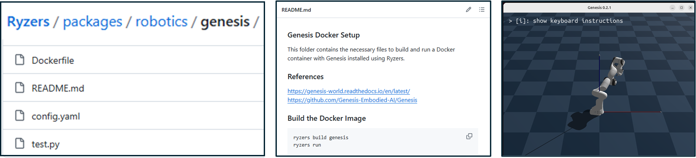

# Contributing to Ryzers

We welcome contributions to the Ryzers! Whether you're fixing bugs, adding new features, or creating new packages, your contributions are greatly appreciated.

---

## Creating Your Own Package

To create your own package, follow the structure and format used in the repository under the `packages` folder. You can use the `packages/robotics/genesis` package as an example. 

### Required Package Contents 

At a minimum, only 4 files are needed to create a ryzers package contribution.

1. **Create a `Dockerfile`**:
   - Start your `Dockerfile` with the following line to ensure it will pull contents from the inital external image (E.g. a PyTorch ROCm image and our `packages/init/ryzers_env` contents):

     ```Dockerfile
     ARG BASE_IMAGE
     FROM ${BASE_IMAGE}
     ```

   - Add the necessary commands to install your package or dependencies.
   - Ensure the `Dockerfile` only includes what is necessary for your package.
   - Ending with a CMD that runs a test script is ideal, as we'll use this to validate the package (still) works.

2. **Create a `config.yaml`**:

    For more details on the config.yaml schema, please see the [packages](packages) section.  The summary schema is below

   - Use the following schema for your `config.yaml`:
     ```bash
        init_image: <string>    # Default: ryzers.RYZERS_DEFAULT_INIT_IMAGE
        gpu_support: <boolean>  # Deafult: True
        x11_display: <boolean>  # Deafult: True

        build_arguments:
        - <key1=value1>  # e.g., "PYTHON_VERSION=3.10"
        - <key2=value2> 

        environment_variables:
        - <key1=value1>  # e.g., "HSA_OVERRIDE_GFX_VERSION=11.0.0"
        - <key2=value2> 

        port_mappings:
        - <host_port1:container_port1>  # e.g., "8888:8888" to expose JupyterLab
        - <host_port2:container_port2>

        volume_mappings:
        - <host_path1:container_path1>  # e.g., "$PWD/workspace/.cache/huggingface:/root/.cache/huggingface" for HF caching
        - <host_path2:container_path2>     

        docker_extra_run_flags: <string> # e.g., "--ulimit memlock=-1" to allow unlimited memory that a process can lock into RAM"
     ```

3. **Create a `test.sh` or `test.py`**:
   - Write a simple bash or Python script to verify that your package was installed correctly. For example:
     ```bash
     #!/bin/bash
     echo "Running tests for <package_name>..."
     <command_to_test_installation>
     if [ $? -eq 0 ]; then
       echo "Tests passed!"
     else
       echo "Tests failed!"
       exit 1
     fi
     ```

4. **Create a `README.md`**:
   - Write a simple README.md that includes:
     - The name of the package.
     - A brief description of what the package does.
     - Instructions for building and running the package.

These 4 files would be placed in a new `packages/<category>/<package_name>` folder.

A good example package to start from is Genesis.  There are the four files required and the README shows a simple call in order to pop up the demo that exits after some time.  




---

## Guidelines for a Package Pull Request

Once you have those minimum files, it can be included in a single pull-request that we will review.  A couple last things:

1. **Follow the Repository Structure**:
   - Make sure your package resides in the appropriate category folder within the `packages` folder.  Or feel free to create a new category folder as needed.

2. **Update main repository README.md with a link to the package**:
   - under `Supported Packages`, add a link to your new package

3. **Test Your Package**:
   - Before submitting your contribution, test your package by building and running it using standard ryzers build and run calls:
     ```bash
     ryzers build <package_name>
     ryzers run 
     ```

---

Thank you for contributing to Ryzers! 
