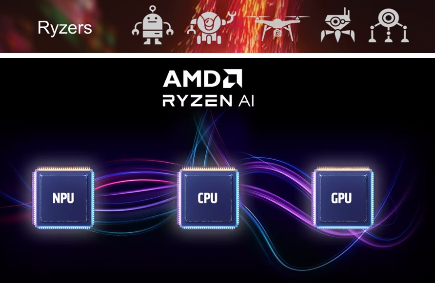

# Overview

The AMD Ryzen AI platform combines CPUs, iGPUs and NPUs onto a single chip available in many laptops and client devices.  This project, Ryzers, provides verified composable Dockerfiles for deploying and running AI workloads, robotics, and other applications optimized for Ryzen AI hardware.  Additionally, build and run steps are simplified down to a handful of Python calls.  

Finally, many example packages come with Ryzers and it is our hope that contributors can easily add softare here for others to use, combine and deploy for their applications.  Our team will regularly update this repository with new packages and Ryzen AI hardware support.

## Table of Contents

* [Installation](installation.md): Learn how to set up the Ryzers Python package and check for system dependencies.
* [Usage](usage.md): Understand how to build and run Ryzers packages for various applications.
* [Packages](packages.md): Discover the simple Ryzers package format.
* [Contributing](contributing.md): Find out how you can contribute to the project.
* [License](license.md): Review the licensing information for this project.

