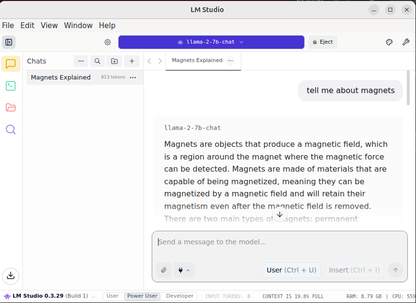

# LM Studio - Local LLM Development Environment



This Ryzer package installs and configures LM Studio, a desktop application for running local LLMs (Large Language Models) on your machine.

## Overview

LM Studio provides an easy-to-use interface for running language models locally without sending data to external servers. This package sets up LM Studio in a containerized environment with support for both GUI and headless server modes.


## Build and run the Package
```bash
ryzers build lmstudio
ryzers run
```

## Volumes
- "$PWD/lmstudio_models" - this host path will cache lmstudio models so you don't have to download them every time. 


## Lmstudio Webpages
- Official documentation: [https://lmstudio.ai/docs](https://lmstudio.ai/docs)


Copyright(C) 2025 Advanced Micro Devices, Inc. All rights reserved.