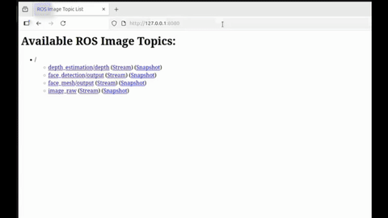

# AMD Ryzen AI CVML

[](#)

---

The Ryzen AI CVML libraries build on top of the Ryzen AI drivers and execution infrastructure to provide powerful AI capabilities to C++ applications without having to worry about training specific AI models and integrating them to the Ryzen AI framework.

## Building and Running the Docker Container

The docker image **must be built on top of the XDNA docker** which contains the installed drivers and runtime to interact with the NPU. Make sure to compose the ryzers together as follows:

```bash
ryzers build xdna ryzenai_cvml
ryzers run
```

The default test will run a sample depth perception app.

## ROS 2 Demo

To run the demo, follow these steps:

### Step 1: Edit config.yaml 

Make sure your `config.yaml` points to your camera device e.g. `/dev/video0`.

```yaml
    # edit this line in config.yaml
    - "--device=/dev/video0:/dev/video0"
```

### Step 2: Include ROS into the ryzer

Run `ryzers build` with the ROS ryzer

```
ryzers build xdna ryzenai_cvml ros
```

### Step 3: Run demo

```
ryzers run /ryzers/demo_ros.sh
```

### Step 4: Visualize streams in your browser

Go to your web browser and type in `0.0.0.0:8080`, this will bring up the ROS 2 `web_video_server` UI where you can click on different topics and visualize video streams.



---

For further details, refer to the official [Ryzen AI CVML documentation](https://github.com/amd/RyzenAI-SW/tree/main/Ryzen-AI-CVML-Library).
