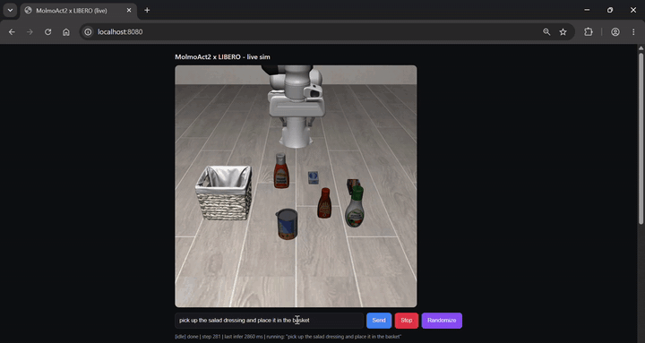
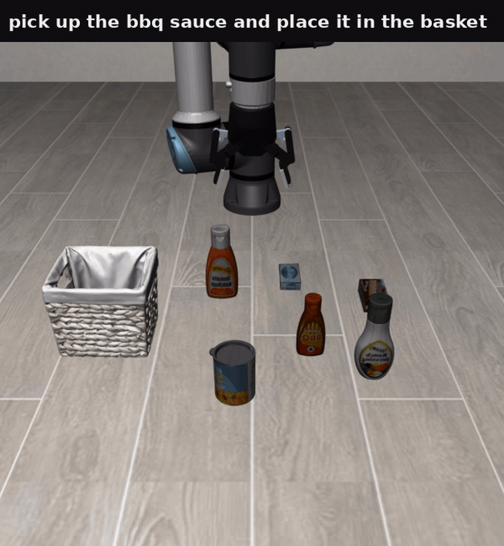
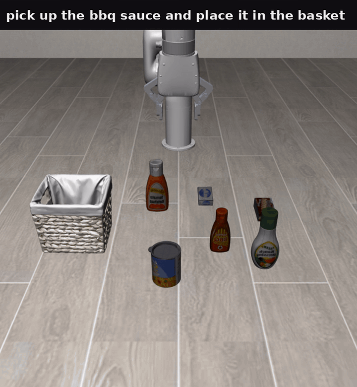
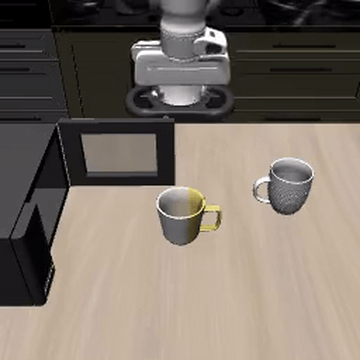

### MolmoAct2

This package runs [MolmoAct2](https://huggingface.co/collections/allenai/molmoact) VLA model on AMD Ryzen AI Max+ 395 (Strix Halo Mini PC). Demos include:

- A browser-based interactive LIBERO simulator with the Panda robot arm.
- Zero-shot cross-embodiment interactive demos for UR5e and xArm6 robot arms.

### Build

```sh
ryzers build molmoact2
ryzers run
```

`ryzers run` with no command is a light ROCm environment check. 

Artifacts are written to `workspace/molmoact2/outputs`.

For downloading weights faster from huggingface, set the environment variable HF_TOKEN to your own access token: `export HF_TOKEN=XXXX....XXXX` 

### Interactive Demo

<p align="center">
  
  <br>
  <em>Interactive browser-based control of a Panda robot in the LIBERO MuJoCo environment.</em>
</p>

To command a robot arm to perform tasks in the LIBERO-MuJoCo simulation environment from a browser:

```sh
ryzers run /ryzers/demo_interactive.sh
```

Then open in a browser:

```text
http://localhost:8080
```

The synchronous demo defaults to the fast path and skips depth reasoning.
For the full depth reasoning model, pass `THINK=1`.


#### Complex Task Example

<p align="center">
  
  <br>
  <em>Prompt: "Put bowl on plate and put cream cheese inside bowl"</em>
</p>

### Cross-Embodiment Interactive Demos

The policy action operates in end-effector coordinates while a robot controller
handles joint movements using inverse kinematics. As a result, the MolmoAct2
policy transfers naturally across robot embodiments in simulation.

#### UR5e with Robotiq85 Gripper

```sh
EMBODIMENT=ur5e ryzers run /ryzers/demo_interactive.sh
```

<p align="center">
  
  <br>
  <em>Zero-shot transfer of MolmoAct2 to a UR5e robot equipped with a Robotiq85 gripper.</em>
</p>

#### xArm6

```sh
EMBODIMENT=xarm6 ryzers run /ryzers/demo_interactive.sh
```

<p align="center">
  
  <br>
  <em>Zero-shot transfer of MolmoAct2 to an xArm6 robot embodiment.</em>
</p>

### Real-Time Interactive Option

The real-time server runs the simulator at wall-clock speed while policy planning
occurs asynchronously. The robot holds its current pose while the next action
chunk is computed. 

```sh
ryzers run /ryzers/demo_interactive_rt.sh #optionally pass EMBODIMENT=xarm6 or EMBODIMENT=ur5e 
```

To see the demo in a browser, open:

```text
http://localhost:8081
```


For longer-horizon tasks (raise the max episode steps; default 1200):

```sh
RT_MAX_STEPS=3000 ryzers run /ryzers/demo_interactive_rt.sh
```

### Closed-Loop LIBERO Evaluation

Run a closed-loop LIBERO rollout in MuJoCo:

```sh
ryzers run /ryzers/demo_libero.sh
SUITE=libero_object TASK_ID=3 ryzers run /ryzers/demo_libero.sh
```

Available suites:

- `libero_10`
- `libero_goal`
- `libero_object`
- `libero_spatial`

`TASK_ID` ranges from `0` to `9`.

<p align="center">
  
  <br>
  <em>Closed-loop LIBERO evaluation rollout in MuJoCo.</em>
</p>

### DROID Open-Loop Replay

Run MolmoAct2-DROID open-loop on a dataset episode:

```sh
ryzers run /ryzers/demo_droid.sh
EPISODE=42 ryzers run /ryzers/demo_droid.sh
```

The demo generates a scene video and a ground-truth versus predicted action plot.

<p align="center">
  
  <br>
  <em>Open-loop replay on a DROID dataset episode.</em>
</p>

### Useful Knobs

- `THINK=1` enables the full depth reasoning path.
- `THINK=0 NUM_STEPS=4` is the fast interactive default.
- `PORT=...` changes the browser port.
- `SEED=...`, `SUITE=...`, and `TASK_ID=...` make runs reproducible.
- `ryzers run /ryzers/download.sh` preloads the MolmoAct2-DROID, MolmoAct2-DROID-Dataset, and
MolmoAct2-Think-LIBERO assets into the mounted cache.

Copyright (C) 2026 Advanced Micro Devices, Inc. All rights reserved.
