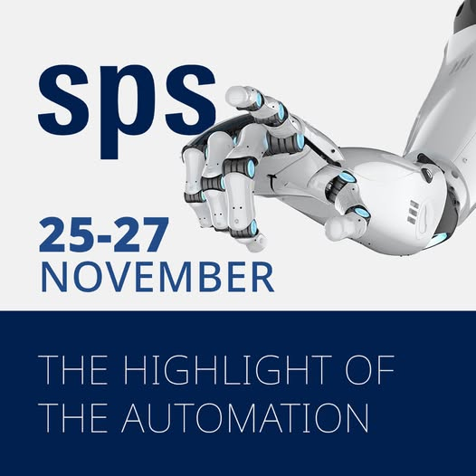
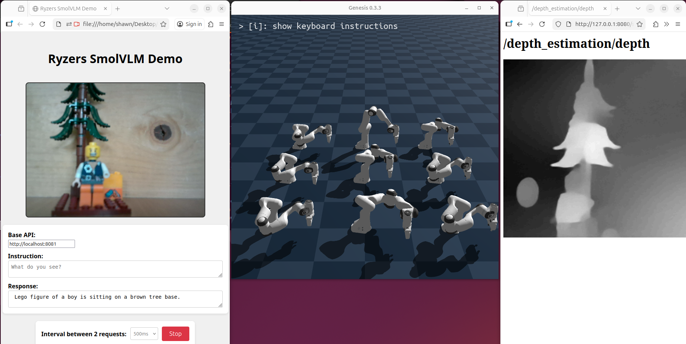
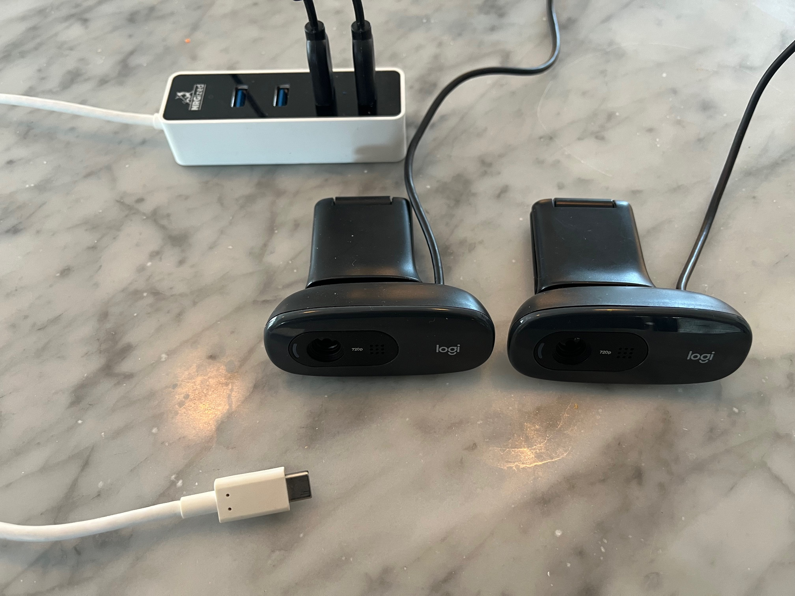
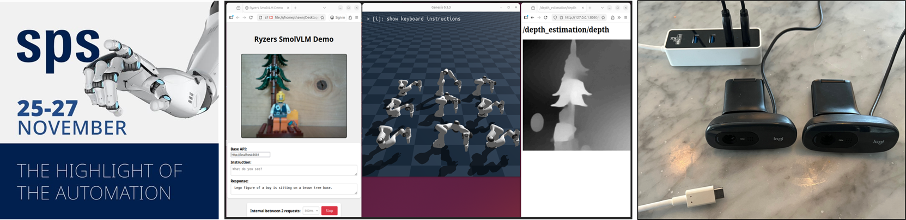

# Ryzers at SPS 2025

<!-- 

 -->



## Required Hardware

On your machine, we will use a USCBC port with a USBC-to-Multi-USBA adapter attached.  Attach 2 C270 Logitech cameras to that adapter and then attach the adapter into the USBC port.

Context: The USB-C port can handle all the camera streams we will be turning on at once - sometimes the standard USB-A controller can run out of streaming memory.

## To Rebuild Demo
- Both SmolVLM and CVML need dedicated access to a webcam.  If only one webcam is available, then only one of SmolVLM or CVML demo can run.  
- The CVML demo has 4 different filters applied to the camera input - any or all four are good for demos.  We like depth perception.

```bash
pushd <Ryzers Install>/packages/workshops/sps25/scripts
./setup_env.sh          # run once
./build_containers.sh   # run once
./start_demos.sh        
```


# troubleshooting
1. SmolVLM needs camera permissions, so do allow access when the webpage comes up.  A refresh of page may be needed to get the firefox pop up asking for permission.
2. SmolVLM should be started (the green button) and set to a 2s interval.  This allows the demo viewer to read the SmolVLM response before new text is generated.  This is not a performance issue.
3. SmolVLM on the first run will download the model (progress can be seen in the terminal).  On next runs, the application will start immediately using a cached copy of the model.
4. if genesis stops simulating, try to stop all demos and run `pkill -f ryzers` to free up system memory.  Reboot is last resort to free up all memory
5. if you only have 1 webcam, you can run the SmolVLM + Genesis demos as-is by commenting out the CVML call in `start_demos.sh`.  If you'd like to run only the CVML+ROS2 demo, some edits are needed to the actual CVML Ryzer (i.e. it needs reverted back) so it will target the 1 webcam.
